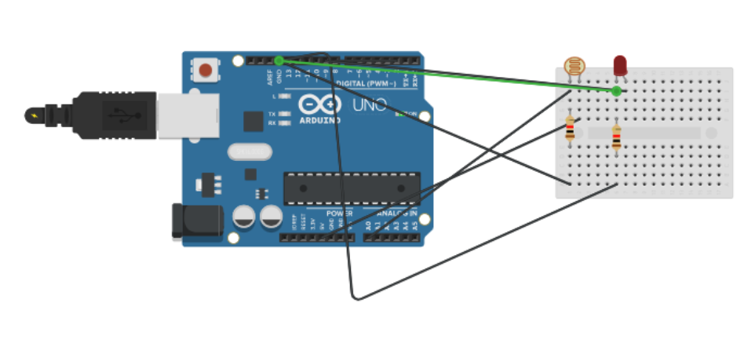

# Project: Simple Sensor-Based LED Control

## Overview
This project reads the input from an analog sensor connected to the Arduino, processes the sensor data, and controls an LED based on the sensor reading. If the sensor input is above a certain threshold (600 in this case), the LED will blink on and off every second. If the input is below the threshold, the LED will remain off.

## Contributor
-[Harshit Dudhani](https://github.com/harshitdudhani)


## Components Used
1. **Arduino Board (e.g., Uno, Nano, Mega)**
2. **Analog Sensor** connected to analog pin A0 (e.g., potentiometer, temperature sensor, light sensor, etc.)
3. **LED** connected to digital pin 9
4. **Resistor** (220 ohms) for the LED

## Circuit Diagram
- Connect the analog sensor to analog pin `A0`.
- Connect the LED to digital pin `9` through a 220-ohm resistor.
- Ensure to have a common ground connection for all components.
<br>
 


## Code Explanation
The code reads the sensor data using `analogRead()`, which converts the analog signal to a digital value between 0 and 1023. If the value exceeds 600, the LED blinks with a 1-second delay. If the value is less than 600, the LED remains off.

## Code
```cpp
int sensorinput = A0;
int data  = 0;

void setup() {
  Serial.begin(9600);
  pinMode(sensorinput, INPUT);
  pinMode(9, OUTPUT);
}

void loop() {
  data = analogRead(sensorinput);
  Serial.println(data);
  
  if (data >= 600) {
    digitalWrite(9, HIGH);
    delay(1000);  // LED ON for 1 second
    digitalWrite(9, LOW);
    delay(1000);  // LED OFF for 1 second
  } else {
    digitalWrite(9, LOW);  // Keep the LED OFF
  }
}
```

## Usage Instructions
1. Upload the code to your Arduino board using the Arduino IDE.
2. Connect the components as per the circuit diagram.
3. Open the serial monitor (set to 9600 baud rate) to view real-time sensor readings.
4. When the sensor reading goes above 600, the LED will start blinking; otherwise, it will stay off.
## License
This project is open-source and available for modification or extension under the MIT License.
