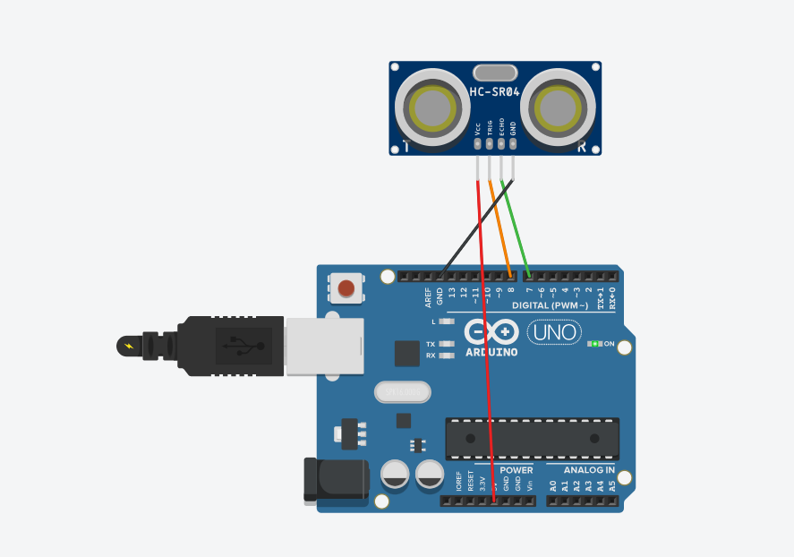

# Ultrasonic Distance Measurement with Arduino

This project demonstrates how to measure distance using an ultrasonic sensor (HC-SR04) with an Arduino. The Arduino emits a pulse via the ultrasonic sensor's trigger pin and measures the time it takes for the echo to return to the sensor. The distance is then calculated based on the time taken for the echo to return.

## Components Required

- Arduino board (e.g., Arduino Uno)
- HC-SR04 Ultrasonic Distance Sensor
- Jumper wires
- Breadboard (optional)


## Pin Connections

- Connect the **Trig** pin of the HC-SR04 to pin **8** on the Arduino.
- Connect the **Echo** pin of the HC-SR04 to pin **7** on the Arduino.
- Connect **VCC** (power) of the HC-SR04 to **5V** on the Arduino.
- Connect **GND** (ground) of the HC-SR04 to **GND** on the Arduino.

## Code
```C
int trig=8,echo=7;

void setup()
{
  pinMode(echo,INPUT);
  pinMode(trig,OUTPUT);
  Serial.begin(9600);
}

void loop()
{
  pulseGenerator();
  int duration=pulseIn(echo,HIGH);
  Serial.println("Duration is : ");
  Serial.println(duration);
  
  duration=duration/2;
  
  double dist=duration * 0.033;
  Serial.print(dist);
}

void pulseGenerator()
{
  digitalWrite(trig,LOW);
  delayMicroseconds(2);
  
  digitalWrite(trig,HIGH);
  delayMicroseconds(10);
  
  digitalWrite(trig,LOW);
  delayMicroseconds(2); 
}
```

## Code Overview

The code initializes the ultrasonic sensor, generates a pulse to trigger the sensor, measures the duration of the echo, and calculates the distance based on the duration. 

### Code Explanation

1. **Initialization**: 
   - `pinMode(echo, INPUT)` sets the echo pin as an input to receive the signal.
   - `pinMode(trig, OUTPUT)` sets the trigger pin as an output to send the pulse.
   - `Serial.begin(9600)` initializes serial communication at 9600 baud rate.

2. **Pulse Generation**: 
   - The `pulseGenerator()` function sends a 10 microsecond HIGH signal to the trigger pin to initiate the ultrasonic measurement.

3. **Distance Calculation**:
   - The `pulseIn(echo, HIGH)` function measures the duration for which the echo pin remains HIGH, which corresponds to the time taken for the sound wave to travel to the object and back.
   - The duration is divided by 2 to account for the round trip of the sound wave.
   - The distance is calculated using the formula: 
     \[
     \text{Distance (cm)} = \frac{\text{Duration (µs)}}{2} \times 0.033
     \]

4. **Output**: 
   - The duration and the calculated distance are printed to the serial monitor.

## How to Run

1. Connect the components as described in the Pin Connections section.
2. Open the Arduino IDE.
3. Copy and paste the code into the Arduino IDE.
4. Upload the code to your Arduino board.
5. Open the Serial Monitor (Tools > Serial Monitor) to view the output.
6. The distance will be displayed in centimeters.

## Troubleshooting

- Ensure that all connections are secure and correct.
- Verify that the ultrasonic sensor is functioning properly.
- Check for any interference that may affect the sensor's readings.

## License

This project is open-source and can be modified and distributed freely.

## Author

-[Harshit Dudhani](https://github.com/harshitdudhani)

Email - harshitdudhani2004@gmail.com

